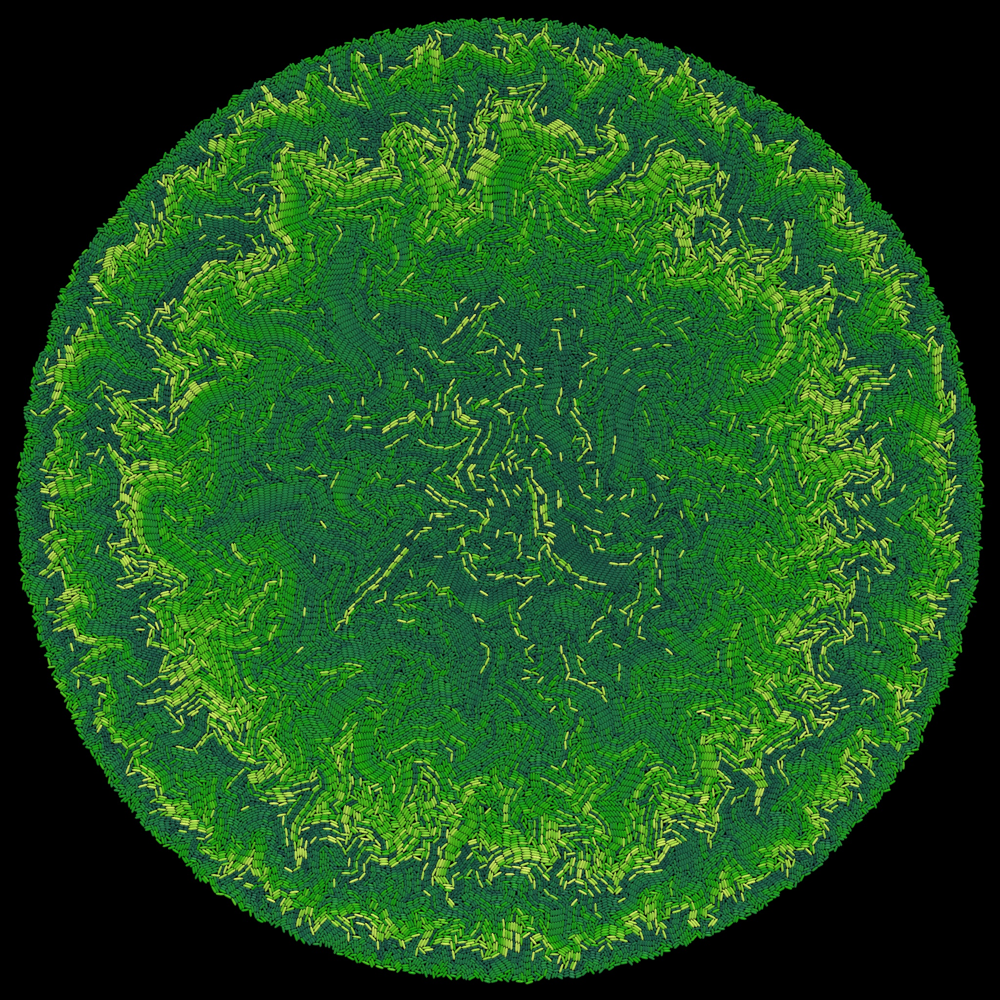
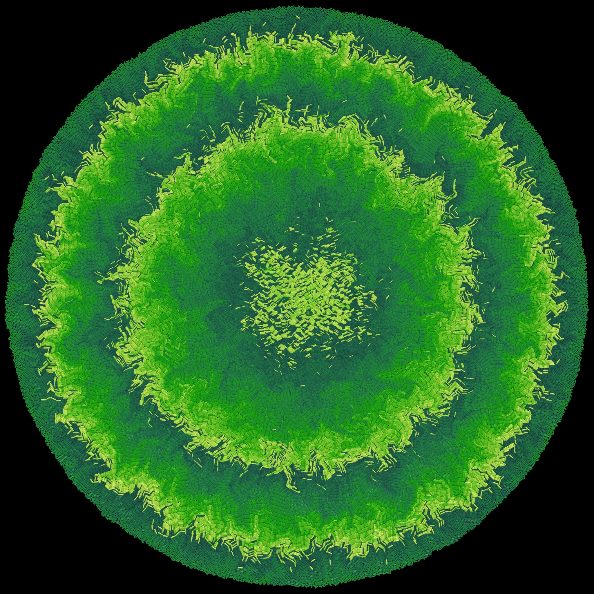

# Interdisciplinary Project: Proliferating Cell Collectives: A Comparison of Hard and Soft Collision Models

Bacteria Growth using Hard Model             |  Bacteria Growth using Soft Model
:-------------------------:|:-------------------------:
 | 
$\lambda = 10^{-3}$, $R_{end} = 100$ | $\lambda = 10^{-3}$, $R_{end} = 100$

## Abstract

TODO

## Table of Contents

TODO

## Thesis

The thesis is available in LaTeX format in this repository. You can access the rendered version in PDF format by clicking the following link:

[Read the Thesis (PDF)](latex/cell-collectives.pdf)

## Slides

The presentation slides are available in PDF format and can be accessed via the following link:

[View the Slides (PDF)](presentation/slides.pdf)

## Code

### Usage

The code is written in C++ and can be compiled using the following command:

```bash
cd demo/cpp/hard
mkdir -p build
cd build
cmake ..
make -j
```

The executable can be run with the following command to see the available options:

```bash
./cellcollectives -help
```

The executable can also be run with `mpirun` to run the simulation using multiple processes:

```bash
mpirun -n 16 ./cellcollectives -mode "hard"
```

### Results

Running the simulation produces output data in `build/src/vtk_output_{mode}` folder.

This data can be conviniently visualized using Paraview using the provided `ParticleDebugger.pvsm` file in the `visualization` folder.
Further scripts are providied in the `/analysis` folder to analyze the simulation data and produce the figures in the thesis.
