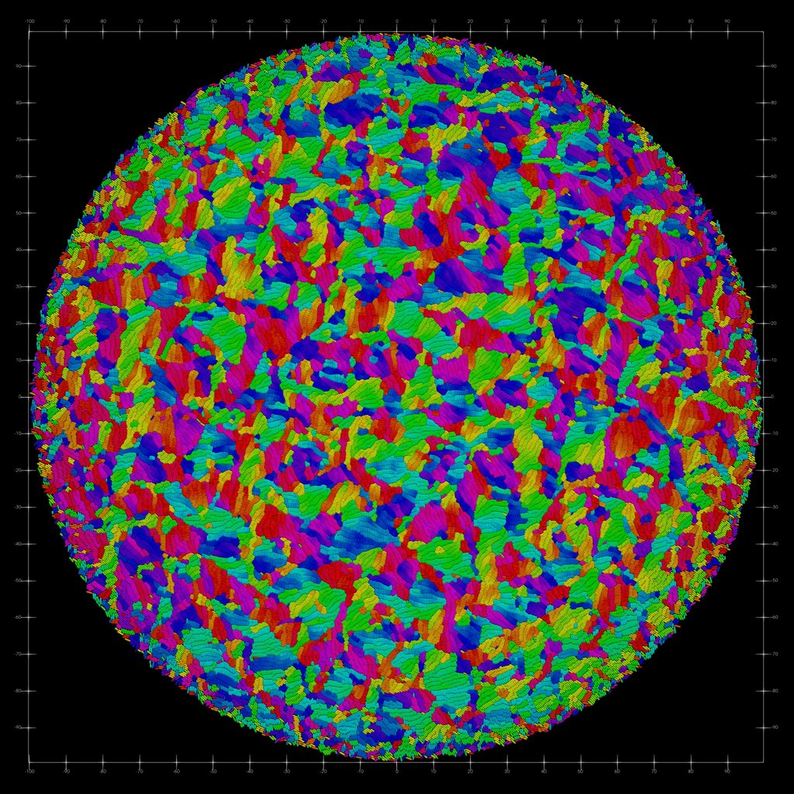

# Interdisciplinary Project: Proliferating Cell Collectives: A Comparison of Hard and Soft Collision Models

🦠 | Bacteria Growth using Hard Model             |  Bacteria Growth using Soft Model
:-------------------------:|:-------------------------:|:-------------------------:
&nbsp;| $R_{end} = 100$ | $R_{end} = 100$
Bacteria Lengths (dark=short, bright=long)| | 
Bacteria Orientation (color=angle)| | 

## Abstract

This work compares hard (constraint-based) and soft (potential-based) collision models for simulating proliferating cell collectives by implementing both approaches within a unified computational framework. Building on the foundational work of Weady et al. [1], we systematically benchmark their performance on bacterial colony growth simulations.

Both approaches successfully reproduce experimentally observed patterns, including concentric rings and microdomain formation. However, they exhibit distinct computational and physical trade-offs. The hard model enforces strict non-overlap and stabilizes at timesteps approximately $30\times$ larger than the soft model ($\Delta t \approx 3 \times 10^{-4}$ h versus $10^{-5}$ h), at higher per-step computational cost. The soft model suffers from numerical stiffness and allows unphysical cell overlap, producing packing fractions exceeding 5 in colony centers compared to the hard model's realistic packing fraction of 0.9.

Moreover, we introduce an adaptive timestepping algorithm based on the Courant-Friedrichs-Lewy condition, which dynamically selects stable timesteps tailored to the current colony state. Benchmarking reveals the hard model outperforms the soft model for small to moderate colonies ($R \leq 100$), while the soft model's superior scalability enables larger final colony sizes ($R \approx 200$) within practical runtimes.

Despite microscopic differences in packing and stress distributions, both models yield comparable macroscopic patterns, suggesting colony-level behavior is robust to collision model details. The soft model provides an efficient, biologically plausible alternative for large-scale studies, while the hard model remains valuable when precise stress calculations or geometric integrity are required.

## Table of Contents

1. **Introduction**
   1. Biological Motivation

2. **Related Work**
   1. Collision Modeling Paradigms
   2. The Benchmarking Gap

3. **Cell Mechanics**
   1. Physical Cell Model
   2. Cell Growth and Division
   3. Rotational Diffusion

4. **Unified Computational Framework**
   1. Colony Representation
   2. Colony Dynamics
   3. State Integration
   4. Soft Collision Model
      1. Force Assembly
      2. Model Parameters and Numerical Stability
   5. Hard Collision Model
      1. Constraint Conditions
      2. Linearization of the Constraint Condition
      3. Nonlinear Complementarity Problem
      4. Energy Minimization Solution
      5. Numerical Solution
      6. Limitations of the Linearization

5. **Implementation**
   1. Distributed Computing Architecture
   2. Collision Handling Pipeline
   3. Adaptive Timestepping
   4. Simulation Output and Availability

6. **Pattern Formation Analysis**
   1. Concentric Ring Patterns
   2. Cell Density and Local Packing Fraction
   3. Colony Growth Dynamics and Number of Cells
   4. Microdomain Formation
   5. Radial Stress Distribution and Growth Rate

7. **Computational Performance**
   1. Critical Time Step
   2. Strong Scaling
   3. Model Efficiency: Walltime and Interaction Overhead
   4. Maximum Attainable Colony Size
   5. Insights into BBPGD Iterations

8. **Discussion and Conclusion**

9. **Future Work**
   1. Adaptive Resource Allocation for Early-Stage Simulations
   2. GPU Acceleration via PETSc
   3. Specialized Molecular Dynamics Libraries for Soft Model Optimization

10. **References**

11. **Appendix**

## Thesis

The thesis is available in LaTeX format in this repository. You can access the rendered version in PDF format by clicking the following link:

[Read the Thesis (PDF)](latex/cell-collectives.pdf)

## Slides

The presentation slides are available in PDF format and can be accessed via the following link:

[View the Slides (PDF)](presentation/slides.pdf)

## Code

### Usage

The code is written in C++ and can be compiled using the following command:

```bash
cd demo/cpp/hard
mkdir -p build
cd build
cmake ..
make -j
```

The executable can be run with the following command to see the available options:

```bash
./cellcollectives -help
```

The executable can also be run with `mpirun` to run the simulation using multiple processes:

```bash
mpirun -n 16 ./cellcollectives -mode "hard"
```

### Results

Running the simulation produces output data in `build/src/vtk_output_{mode}` folder.

This data can be conviniently visualized using Paraview using the provided `ParticleDebugger.pvsm` file in the `visualization` folder.
Further scripts are providied in the `/analysis` folder to analyze the simulation data and produce the figures in the thesis.
